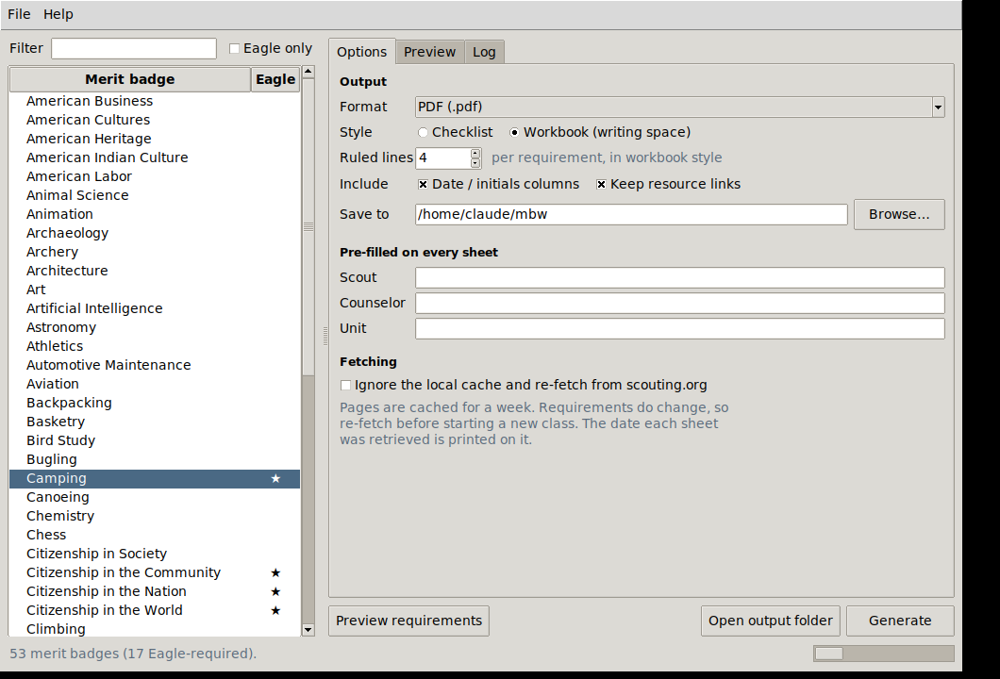
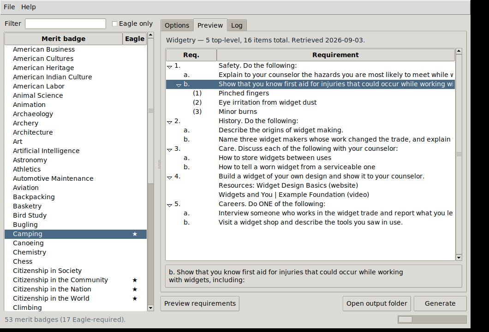

# merit-badge-workbook

Generates a printable requirements checklist, note-taking workbook or blue
card for any Scouting America merit badge, from the official source:
<https://www.scouting.org/skills/merit-badges/all/>

Output formats: Markdown, printable HTML, PDF, JSON, and blue cards.

The requirements for all 143 badges are built into the app, so it starts
instantly and works with no network. `Requirements > Check for updates` (or
`--check-updates`) re-fetches the site and tells you what has changed since.

## Install

macOS / Linux:

```bash
python -m venv .venv && source .venv/bin/activate
pip install -e ".[app]"
```

Windows (PowerShell):

```powershell
py -m venv .venv
.\.venv\Scripts\Activate.ps1
py -m pip install -e ".[app]"
```

If PowerShell refuses to run the activate script, either allow it for the
current shell with `Set-ExecutionPolicy -Scope Process RemoteSigned`, or skip
the venv entirely and use `py -m pip install --user -e ".[app]"`.

The `app` extra pulls in everything: PySide6 for the window, ReportLab for PDF,
and pypdf for filling blue card templates. If you only want the command line,
`.[pdf]` is enough; the extras are `gui`, `pdf` and `cards`.

That puts `mbworkbook` and `mbworkbook-gui` on your PATH. Pip will warn if the
Scripts directory (usually `%APPDATA%\Python\Python3xx\Scripts`) is not on
PATH; you can ignore that and use `py -m mbworkbook` instead.

Or run it straight from the source tree without installing:

```bash
pip install requests beautifulsoup4 lxml reportlab PySide6 pypdf
python -m mbworkbook --help
```

## Use

### Desktop window

```bash
mbworkbook-gui          # or:  python -m mbworkbook --gui
```



Pick badges on the left (Ctrl-click or Shift-click for several at once), set
the options on the right, hit Generate. The Preview tab shows the parsed
requirement tree so you can check a badge came out right before printing a
stack of them; the Log tab records what was written and what failed.



Everything slow runs on a background thread, so the window stays responsive,
and every job can be stopped with Cancel — a batch of 143 badges does not
commit you to sitting through it.

Your format, style, counselor, unit, card template and output folder are
remembered between sessions. Settings live in `%APPDATA%\MeritBadgeWorkbook`
on Windows, `~/Library/Application Support/MeritBadgeWorkbook` on macOS and
`~/.config/merit-badge-workbook` elsewhere; the page cache goes in
`%LOCALAPPDATA%` / `~/Library/Caches` / `~/.cache`. Directories from before
1.1 are moved on first run.

### Blue cards

The three-part application for merit badge — what everyone calls the blue card.
Pick `Blue card` as the format, or `-f card` on the command line:

```bash
mbworkbook Camping -f card --scout "A. Scout" --unit "Troop 379"     --counselor "M. Counselor"
```

By default the app draws its own three-part card: the applicant's, counselor's
and unit leader's panels, with cut guides down the perforations. Print it on
blue cardstock and it works the way the real one does. Every panel is marked
unofficial, because some councils accept printed cards and some insist on the
pre-printed stock from the Scout shop — check before a Scout relies on one.

Better, if your council publishes a **fillable** blue card PDF: point the app
at it and it fills the real form instead, including the requirement grid.

```bash
mbworkbook Cooking -f card --card-template ~/Downloads/blue-card-fillable.pdf     --scout "A. Scout" --unit "Troop 379"
```

In the window, `Blue card template` under Destination does the same, and
remembers your choice. A council sheet holds three cards, so badges are packed
three to a sheet; select several badges and you get one PDF of cards for the
whole stack.

The template is **not** shipped with this app. It is Scouting America's form,
and redistributing it is not ours to do — so download your council's copy and
point at it. Search your council's site for "merit badge application fillable";
[Gateway Area Council publishes one][gateway], for instance.

[gateway]: https://www.gatewayscouting.org/files/23019/Merit-Badge-Application--Blue-Card---fillable-

### Command line

```bash
# What badges exist? (* marks Eagle-required)
mbworkbook --list
mbworkbook --list --eagle-only

# A checklist in Markdown (default)
mbworkbook Camping

# A printable PDF workbook with writing space, pre-filled
mbworkbook "personal management" -f pdf --style workbook \
    --scout "A. Scout" --counselor "M. Counselor" --unit "Troop 379"

# Pick from a menu
mbworkbook --pick -f html

# Structured data for something else to consume
mbworkbook Cooking -f json -o cooking.json

# Every Eagle-required badge into one folder
mbworkbook --all --eagle-only -f pdf -o ./eagle-packets/
```

Both front ends run through the same `service.py`, so anything the window can
do the CLI can do too — handy if you want this in a cron job or a Makefile.

Useful flags:

| Flag | Effect |
| --- | --- |
| `--style workbook` | Adds ruled writing space under each leaf requirement |
| `--note-lines N` | How many ruled lines (default 4) |
| `--no-signoff` | Drops the date / counselor-initials columns |
| `--no-resources` | Drops the "Resources:" links some badge pages carry |
| `--refresh` | Bypass the cache and re-fetch |
| `--dump-html page.html` | Save the raw page, for when parsing goes wrong |
| `--html-file page.html` | Parse a saved page instead of fetching |
| `--card-template f.pdf` | Fill a council's fillable blue card instead of drawing one |
| `--check-updates` | Re-fetch everything and report what changed |
| `--online` | Ignore the built-in requirements for this run |

Fetched pages are cached for a week (see the directories above; override with
`MBW_CACHE_DIR`). Requests are rate-limited to one per second
and identify themselves; set `MBW_CONTACT` to put your email in the User-Agent.

### Keeping the requirements current

The built-in copy is a snapshot, and requirements change. To see what has moved:

```bash
mbworkbook --check-updates
```

That re-fetches every badge at one request per second — a few minutes — and
reports which have changed, which are new to the A-Z index and which have been
dropped. It exits 1 when anything changed, so it works in a cron job. The
window has the same thing under `Requirements > Check for updates`, with a
progress bar and a Cancel button.

To generate from the live site rather than the built-in copy, use `--refresh`
for one badge or `--online` for a whole run; in the window, tick
`Re-fetch from scouting.org`.

To rebuild the shipped snapshot before cutting a release:

```bash
python tools/build_snapshot.py
```

## How the parsing works

The badge pages are Elementor-generated and the markup is not consistent
between badges. Sub-requirements show up three different ways depending on the
page: inside accordion panels, inside nested `<ol>` lists, or as one text block
split by `<br>`.

Pages on the current template wrap each requirement in `.mb-requirement-item`
and put the printed marker in its own `<span>`, separate from the text. The
parser reads that structure directly when it is present (`parser.structured_lines`),
since it says the hierarchy unambiguously.

For anything else, it falls back to a layout-independent pass that:

1. Finds the region around the heading containing "Requirements".
2. Flattens it into text lines in document order (`parser.extract_lines`).
3. Rebuilds the hierarchy from the printed markers — `1.`, `a.`, `(1)`, `ii.` —
   using a stack of marker *types* (`parser.build_tree`). A type already on the
   stack means "sibling at that level"; a new type means "one level deeper".
   That handles any numbering scheme a badge happens to use.

Along the way it drops page furniture (nav, "the requirements will be fed
dynamically…", "View Related Merit Badges"), and it will not start collecting
until it sees requirement `1.`, so Scout Life article text on the same page
that mentions "requirement 4" does not leak in.

Lines with no marker attach to the previous requirement as a continuation, and
lines starting with `Resources:` become notes rather than requirements.

## Known caveats

- Eyeball the output for an unfamiliar badge before you hand a stack of these
  to Scouts. If one comes out wrong, grab the page with `--dump-html`. For a
  page on the current template the fix is usually in `structured_lines`; for an
  older-looking page it is usually a new pattern in `NOISE_LINE` or
  `TITLE_CLASS_HINTS` in `parser.py`.
- Some badge pages say requirements are "fed dynamically using the Scoutbook
  integration". That text is boilerplate and is dropped — the requirements
  themselves are in the served HTML. But if a badge ever does parse to zero
  requirements, that is the case to suspect: fetch the page once in a browser,
  save it, and pass it with `--html-file`.
- Requirements change, and the built-in copy is frozen at the date printed on
  every sheet and shown in the Options tab. Run `--check-updates` before each
  new class rather than trusting a snapshot indefinitely.
- The blue card the app draws is unofficial, and so is a filled council
  template once it leaves your printer. Confirm your council accepts printed
  cards before a Scout carries one to a board of review.
- The requirement text belongs to Scouting America. These sheets are a
  note-taking aid for Scouts and counselors; the official requirements are the
  ones on scouting.org and in the current pamphlet. Don't redistribute the
  generated files as if they were official workbooks.

## Building the Windows app

The released app is a PyInstaller bundle wrapped in an Inno Setup installer, so
a unit volunteer never has to see Python.

```powershell
python tools/build_snapshot.py                       # refresh the requirements
python -m PyInstaller packaging/mbworkbook.spec --noconfirm
& "$env:LOCALAPPDATA\Programs\Inno Setup 6\ISCC.exe" packaging\installer.iss
```

That leaves `dist\MeritBadgeWorkbook\` (the runnable bundle) and
`dist\MeritBadgeWorkbook-<version>-Setup.exe` (the installer).

The bundle carries two executables sharing one copy of the Qt runtime:
`MeritBadgeWorkbook.exe` is the window, with no console behind it, and
`mbworkbook.exe` is the same CLI for scripting a batch.

It is `--onedir`, not `--onefile`, on purpose: a onefile build unpacks the
whole Qt runtime to a temp directory on every launch, which is slow and is a
reliable way to get flagged by antivirus heuristics. The installer hides the
directory anyway. The spec also drops the Qt modules nothing here uses (QML,
WebEngine, 3D, multimedia), which roughly halves the result.

The installer is per-user (`PrivilegesRequired=lowest`), so it needs no admin
rights — the usual case on a school or work laptop. Uninstalling removes the
page cache but deliberately leaves settings behind, in case of a reinstall.

## Tests

```bash
pip install pytest
python -m pytest tests -q
```

The fixtures use invented requirement text: `sample_badge.html` reproduces the
three older markup shapes and `sample_badge_structured.html` the current
template. Nothing in the suite touches the network — the update-check tests
inject a fake fetcher — so it runs offline in a couple of seconds. The window
itself needs a display and is not exercised in CI; the worker and cancellation
it depends on are tested directly.

## Layout

```
pyproject.toml     Packaging; defines the mbworkbook / mbworkbook-gui commands
tools/
  build_snapshot.py  Rebuilds the shipped requirements, run before a release
mbworkbook/
  __init__.py      Package marker and version
  __main__.py      Entry point for `python -m mbworkbook`
  paths.py         Per-platform config and cache directories
  models.py        Badge / Requirement dataclasses, tree walking
  fetch.py         HTTP with disk cache and rate limiting
  catalog.py       A-Z index scraping, fuzzy badge-name resolution
  parser.py        HTML -> requirement tree
  snapshot.py      The shipped requirements, and the update check
  jobs.py          Background worker with cancellation, no toolkit imports
  data/
    requirements.json  All 143 badges, prebuilt
  render/
    __init__.py    Markdown + JSON, shared WorkbookOptions
    html.py        Printable HTML with a print stylesheet
    pdf.py         ReportLab PDF
    card.py        Blue card drawn from scratch
    cardform.py    Blue card filled into a council's fillable PDF
  service.py       fetch -> parse -> render, shared by both front ends
  cli.py           Argument handling
  gui.py           PySide6 window
tests/
  test_parser.py         Markers, tree building, page parse, catalog, renderers
  test_snapshot.py       Fingerprints, snapshot round trip, the update check
  test_paths_and_jobs.py Platform directories, worker, cancellation
  test_gui.py            The shared service layer and card output
  fixtures/              Synthetic badge pages for both markup generations
docs/                    Screenshots and a sample generated workbook
```

Everything under `mbworkbook/` uses relative imports, so the files have to stay
in that package directory — flattening them into one folder breaks every
`from .models import ...`.
